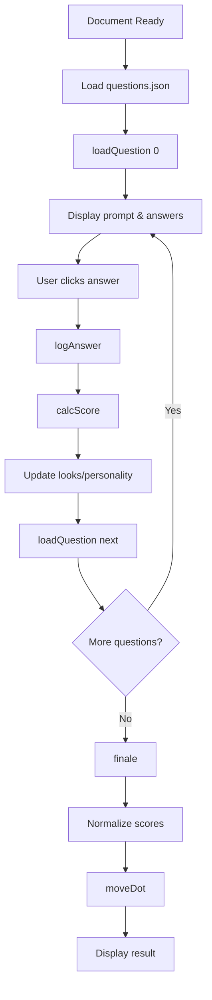

The Incel Test is powered by JavaScript functions in `questioner.js` that handle question loading, answer processing, score calculation, and result display.

## Core Variables

The quiz maintains several global state variables:

```javascript
var questionList = Array;      // Array of all questions loaded from JSON
var questionNum = 0;            // Current question index
var numAnswers;                 // Number of answers for current question
var isLooks;                    // Whether current question is about looks
var personality = 0;            // Accumulated personality score
var personalityCount = 0;       // Total possible personality points
var looks = 0;                  // Accumulated looks score
var looksCount = 0;             // Total possible looks points
var currentWeight = 1;          // Weight of current question
```

## Function Reference

### loadQuestion()

Loads and displays a question by its index.

```javascript
function loadQuestion(questionId)
```

**Parameters:**
- `questionId` (number): The index of the question to load from the question list

**Behavior:**

<Steps>
  <Step title="Check for completion">
    If `questionId` exceeds the question list length, calls `finale()` and returns
  </Step>
  
  <Step title="Clear previous answers">
    Empties the answer area and updates the current question number
  </Step>
  
  <Step title="Display prompt">
    Sets the question prompt text from the question object's `prompt` property
  </Step>
  
  <Step title="Generate answer buttons">
    Iterates through the `answers` array and creates a button for each answer with ID `quizA{index}`
  </Step>
  
  <Step title="Set question metadata">
    Retrieves the question's `weight` and `isLooks` properties and updates tracking variables
  </Step>
  
  <Step title="Update counters">
    Adds the weight to either `looksCount` or `personalityCount` depending on question type
  </Step>
</Steps>

**Implementation:**

```javascript
function loadQuestion(questionId) {
    if (questionList.length <= questionId) {
        finale();
        return;
    }

    questionNum = questionId;

    $("#quizAreaAnswers").empty();
    console.log("└  Answers cleared");

    // Load the question
    var q = questionList[questionId];
    console.log("Question loaded into memory.");

    // Display prompt
    $("#quizAreaPrompt").prop('innerHTML', q.prompt);
    console.log("│  Prompt " + questionId + ", \"" + q.prompt + "\" displayed.");

    // Create a button for each answer
    $.each(q.answers, function(index, value) {
        $("<button>", {
            "class": "answer btn btn-outline-primary btn-lg btn-block",
            "text": value,
            "id": "quizA" + index
        }).appendTo("#quizAreaAnswers");
        numAnswers = index;
    });
    console.log("│  Answer list " + questionId + " displayed with " + (numAnswers + 1) + " answers.");

    // Retrieve weighting
    currentWeight = q.weight;
    console.log("│  Question " + questionId + " has weight " + currentWeight + ".");

    // Retrieve looks or personality
    isLooks = q.isLooks;
    if (isLooks) {
        console.log("│  Question " + questionId + " is about looks.");
        looksCount += currentWeight;
    } else {
        console.log("│  Question " + questionId + " is about personality.");
        personalityCount += currentWeight;
    }
}
```

---

### logAnswer()

Processes a user's answer selection and advances to the next question.

```javascript
function logAnswer(answerId)
```

**Parameters:**
- `answerId` (number): The index of the selected answer

**Behavior:**

<Steps>
  <Step title="Retrieve answer text">
    Gets the text content from the clicked button element
  </Step>
  
  <Step title="Update progress bar">
    Increments the progress bar value and width percentage
  </Step>
  
  <Step title="Display answer history">
    Creates a card showing the question prompt and selected answer, prepending it to the answered questions column
  </Step>
  
  <Step title="Calculate score">
    Calls `calcScore()` with the answer ID and number of options
  </Step>
  
  <Step title="Update score variables">
    Adds the calculated score to either `looks` or `personality` based on question type
  </Step>
  
  <Step title="Load next question">
    Calls `loadQuestion()` with the next question index
  </Step>
</Steps>

**Implementation excerpt:**

```javascript
function logAnswer(answerId) {
    var answerText = document.getElementById("quizA" + answerId).innerHTML;
    $("#progressbar").attr('aria-valuenow', questionNum + 1);
    $("#progressbar").attr('style', 'width: ' + (100 * (questionNum + 1) / questionList.length) + '%');

    // Create answer history card
    $("<div></div>", {
        "class": "card border-primary mb-3",
        "id": "formerAnswer" + questionNum
    }).prependTo("#answeredCol");
    $("<div></div>", {
        "class": "card-header",
        "text": questionList[questionNum].prompt
    }).appendTo(("#formerAnswer" + questionNum));
    $("<div></div>", {
        "class": "card-body",
        "id": "formerAnswer" + questionNum + "body"
    }).appendTo(("#formerAnswer" + questionNum));
    $("<p></p>", {
        "class": "card-text",
        "text": answerText
    }).appendTo(("#formerAnswer" + questionNum + "body"));

    var score = calcScore(answerId, numAnswers);
    console.log("│  Raw score:" + score + ".");
    if (isLooks) {
        looks += score;
        console.log("│  Looks value is now " + looks + ".");
    } else {
        personality += score;
        console.log("│  Personality value is now " + personality + ".");
    }

    loadQuestion(questionNum + 1);
}
```

---

### calcScore()

Calculates the score for a given answer based on its position in the answer list.

```javascript
function calcScore(answer, options)
```

**Parameters:**
- `answer` (number): The index of the selected answer (0-based)
- `options` (number): The total number of answer options

**Returns:**
- `number`: The calculated score, weighted by `currentWeight`

**Algorithm:**

<Accordion title="Scoring Logic">
  The function uses a recursive approach to handle odd and even numbers of answers:
  
  1. **Even number of answers**: Calculates score directly using the formula:
     ```
     score = ((answer - n) / n) * currentWeight
     ```
     where `n = options / 2`
     
     This creates a symmetric distribution from negative to positive scores.
  
  2. **Odd number of answers**: Recursively calls itself with adjusted parameters:
     - If answer is in the first half: `calcScore(answer, options + 1)`
     - If answer is in the second half: `calcScore(answer + 1, options + 1)`
     
     This effectively treats odd-numbered answer sets as even-numbered by padding.
</Accordion>

**Implementation:**

```javascript
function calcScore(answer, options) {
    n = options / 2;
    if ((options % 2) != 0) {
        console.log("│  Odd number of answers.")
        if (answer < ((options + 1) / 2)) {
            return calcScore(answer, options + 1);
        } else {
            return calcScore(answer + 1, options + 1);
        }
    }
    console.log("│  Even number of answers.")
    return ((answer - n) / n) * currentWeight;
}
```

**Example:**
For 4 answers with weight 1.0:
- Answer 0: `((0 - 2) / 2) * 1.0 = -1.0`
- Answer 1: `((1 - 2) / 2) * 1.0 = -0.5`
- Answer 2: `((2 - 2) / 2) * 1.0 = 0.0`
- Answer 3: `((3 - 2) / 2) * 1.0 = 0.5`

---

### moveDot()

Positions the indicator dot on the results chart based on calculated scores.

```javascript
function moveDot(xOffset, yOffset)
```

**Parameters:**
- `xOffset` (number): Horizontal offset for the dot (personality score)
- `yOffset` (number): Vertical offset for the dot (looks score)

**Behavior:**
Applies an SVG transform to the `#pinpoint` element to position it on the chart coordinates.

**Implementation:**

```javascript
function moveDot(xOffset, yOffset) {
    var dot = document.getElementById("pinpoint");

    if (dot) {
        var transformAttr = ' translate(' + xOffset + ',' + yOffset + ')';
        dot.setAttribute('transform', transformAttr);
    }
}
```

---

### finale()

Calculates final results and displays the user's classification.

```javascript
function finale()
```

**Behavior:**

<Steps>
  <Step title="Clear quiz area">
    Empties the answer area and updates the prompt to "Your score"
  </Step>
  
  <Step title="Normalize scores">
    Scales both personality and looks scores to a range of -253 to +253:
    ```javascript
    var personalityFinal = -1 * personality * (253 / personalityCount)
    var looksFinal = looks * (253 / looksCount)
    ```
    Note: Personality is inverted (multiplied by -1)
  </Step>
  
  <Step title="Position chart dot">
    Calls `moveDot()` with the final scores and displays the chart
  </Step>
  
  <Step title="Determine classification">
    Based on the quadrant of the final scores, displays one of five results:
    - **Jared Fogle**: Both scores are 0
    - **Beta Beta**: personality ≤ 0, looks ≥ 0
    - **Beta Chad**: personality ≤ 0, looks ≤ 0
    - **Chad Beta**: personality ≥ 0, looks ≥ 0
    - **Chad Chad**: personality > 0, looks < 0
  </Step>
  
  <Step title="Display result">
    Shows the appropriate message card with styling and description
  </Step>
</Steps>

**Score Normalization:**

The normalization formula ensures that regardless of the total weights of all questions, the final score fits within the chart's coordinate system (±253 pixels).

```javascript
var personalityFinal = -1 * personality * (253 / personalityCount)
var looksFinal = looks * (253 / looksCount)
```

## Initialization

The quiz initializes when the document is ready:

```javascript
$(document).ready(function() {
    console.log("Document loaded.");

    // Attach click handler to answer buttons
    $("#quizAreaAnswers").on('click', 'button', function(event) {
        var ansNum = Number(event.target.id.substring(5));
        logAnswer(ansNum);
    });

    // Load questions from JSON file
    $.getJSON("assets/data/questions.json",
        function(data) {
            questionList = data;
            console.log("Question list loaded:");
            console.log(questionList);
            loadQuestion(0);
            $("#progressbar").attr('aria-valuemax', questionList.length);
        });
});
```

## Function Flow


